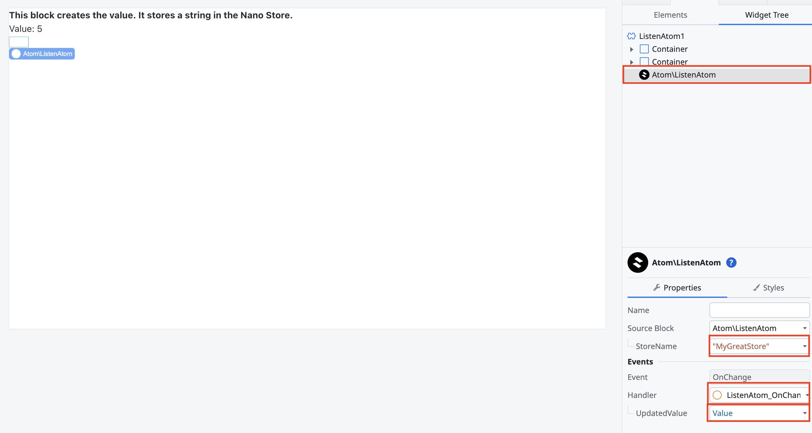

[Nano Stores](https://github.com/nanostores/nanostores) is a state library that allows for communication between Island components and OutSystems components.


## Documentation
Refer to the full [Nano Stores documentation](https://github.com/nanostores/nanostores#table-of-contents) for implementation of the library.

Nano Stores are currently supported for the following libraries:

- [React](https://github.com/nanostores/react)
- [Svelte](https://svelte.dev/docs/svelte/svelte-files#script-4-prefix-stores-with-$-to-access-their-values)
- [Vue](https://github.com/nanostores/vue)

Nano Stores for Angular is not currently supported.

## Sharing state between Astro Islands
Create the objects inside of the stores folder (or other preferred structure). You can create a store and then have your components subscribe and update the stores. Refer to each libraries documentation on how to listen, subscribe and update.

## Sharing state between OutSystems and Astro Islands
The OutSystems module, Lightweight State Manager, is available for both the O11 and ODC platforms.

- [O11](https://www.outsystems.com/forge/component-overview/23528/lightweight-state-manager-o11)
- ODC

OutSystem currently supports the following structures:

- [Atoms](https://github.com/nanostores/nanostores#atoms)
- [Maps](https://github.com/nanostores/nanostores#maps)

In OutSystems, you need to use the Nano Stores component and pull in blocks for either Listen/Subscribe to an Atom or Map.  The imported block will require a store name and a handler for changes that happen to the store value/map.



You can reference the Nano Store Atom or Map from the window inside of your component.

React:
```jsx
import { useStore } from "@nanostores/react";
import { useState } from "react";


export default function Counter({}) {
  const nanoStoreValue = useStore(window.Stores["MyGreatStore"]);

  return (
    <>
        <div>
            <strong>Nano Store value:</strong>
            <div>{nanoStoreValue}</div>
        </div>
    </>
  );
}
```

Svelte:
```svelte
<script lang="ts">
  const nanoStoreValue = (window as any).Stores["svelteStore"];
</script>

<div>{$nanoStoreValue}</div>
```

Vue:
```vue
<script setup lang="ts">
import { useStore } from "@nanostores/vue";
const nanoStoreValue = useStore(window.Stores["MyGreatStore"]);
</script>

<template>
    <div>
          <div>{{ nanoStoreValue }}</div>
    </div>
</template>

```