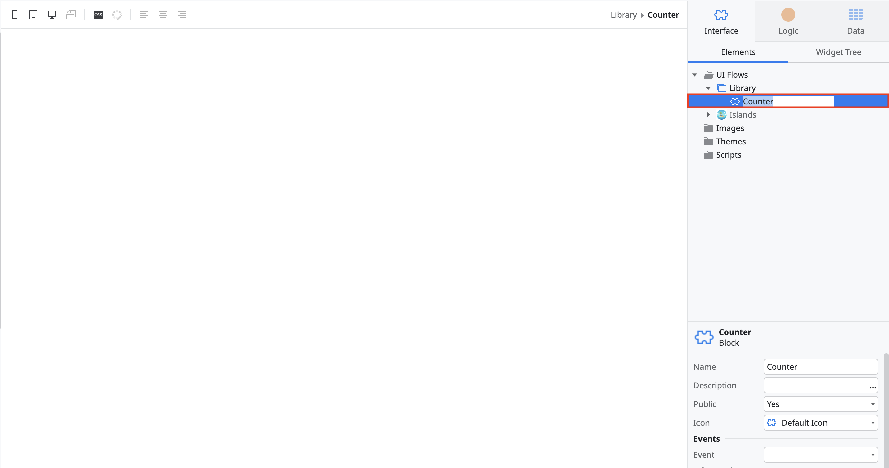
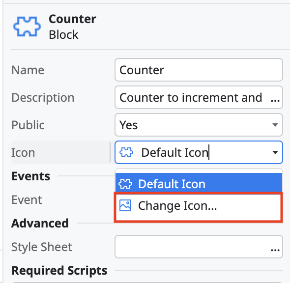
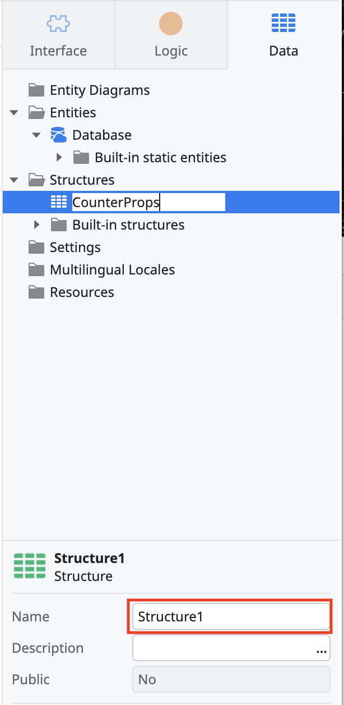
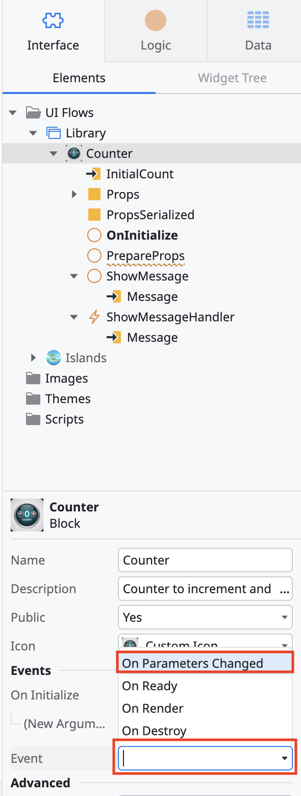
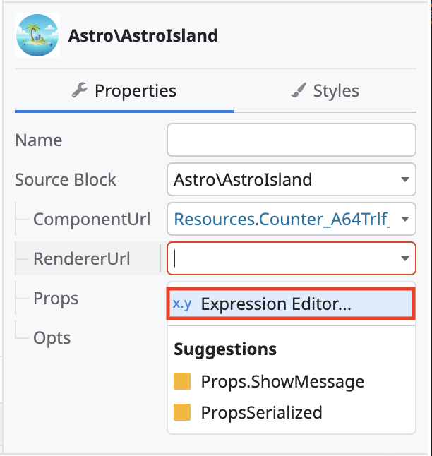
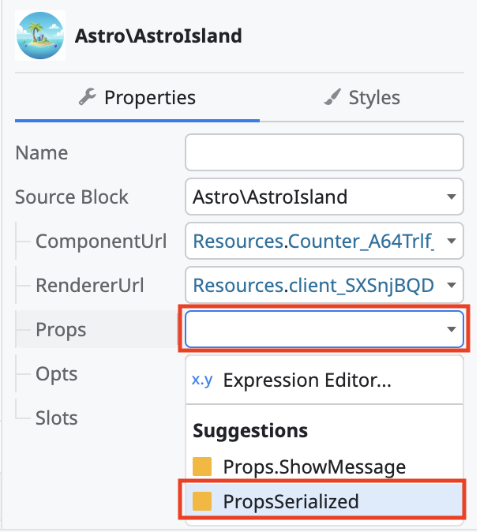

## Forge component

In ODC Studio, install the OutSystems Astro Islands Forge component.

## Building a separate library

This is the recommended approach. It allows isolation of your library in a separate module/application. It allows better reusability across other apps in your OutSystems instance.

- Click the **Create** button and choose **Library** from the dropdown.
  

- On the **Enter your library details** screen, add the name, description (optional) and icon(optional). Click the **Create Library** button.
  

## Adding Islands dependency

- Right click on the UI Flows folder and select Add public element...
  

- On the **Add public elements to [library]** popup, select the **All sources** dropdown and search for Islands. On the second dropdown, where UI Flow may be selected, select **All sources**. From the elements list, select the `Astro` flow, `AstroIsland` block and `CreateFunctionProp` client action. Click the **Add** button.
  

## Editing module

- Right click on UI Flow and click Add UI Flow. Give the flow a name such as Library. This can also be updated later in the information panel.
  
  

- Right click on the newly created flow and click Add Block. Give it a name.
  
  

- Give the block a description and icon. It is recommended to add description and change the default icon. If both of these are done, when consumed, your library/widget can be made available as a selectable element in the component panel.
  - Click on the block name. Select the three dots in the information panel to edit the description. Click the close button in the description popup.
    
  - In the information panel, click on the dropdown that says **Default Icon** and select **Change Icon**. Find and upload the icon you would like to use.
    

- Change the Public attribute to Yes if this block will be consumed by other modules.
  

## Parameters

Astro Islands can take input parameters and functions, but they must first serialized in a particular way. Text and objects must be serialized using the tools provided by the OutSystems Astro Islands module.Functions/handlers must be bound to the `window` (or `documnet`, but `window` is preferred) object as that is the only method to invoke them. See the [Using OutSystems handlers](#using-outsystems-handlers) section to view implementation in the Astro component.

- Right click on the block and click on add input parameter. Give the parameter a name and type. The parameter can be text, number or structure. Do this for every input parameters.
  
  

- Go to the Data tab in ODC Studio.
  

- Right click on structures and select `Add a structure`.
  

- Give the structure the name of library and Props (for example, CounterProps). This is to distinguish it from any other blocks in this library that may have props.
  

- Add every input parameter as an attribute into the Prop structure. Make sure to set their types. Any function handlers should be added by their name as a text attribute type.
  

- Go back to the Interface tab and click on the block.
  

- Right click on the block and select **Add Local Variable**.
  

- Give the new local variable the name **Props** and then select the structure you created in the previous steps as the type. This is the incoming parameters that will be passed into the front-end library.
  

- Create another local variable and call it **PropsSerialized**. The type for this variable should be **Text**. This is the serialized value that is necessary for the `astro-island` component to process the values.
  

### Initialize and apply parameters

#### Prepare parameters

- If there are any functions handlers coming in, create a function and a function handler. The function should call the handler (with any parameters that it needs).
  - To add a client action, right click on the block and select the `Add Client Action`. Give the action a name. Make sure to add any input and output parameters your action needs.
    
  - To add an event handler, right click on the block and select `Add Event`. Give the event handler a name. Make sure to match any of the input and output parameters.
    
  - You can then assign the event handler inside of the client actions.
    

- Right click on the Counter block and select Add Client Action. Name it PrepareProps.
  

- If you have any functions, you will need to add a special JavaScript block. Drag over the JavaScript component and name it `SetFunctionProps`. Open the JavaScript contents.
  
  

- Inside of the JavaScript block, you will need to bind any function handlers to the `window` object. There is also and Astro Island function to randomize the name so that there are no function collisions. You can use the following script to bind them (update names to match your components):

  ```js
  const ShowMessageName = $actions.CreateFunctionProp("ShowMessage").UpdatedFunctionName;
  window[ShowMessageName] = $actions.ShowMessage;
  $parameters.ShowMessageName = ShowMessageName;
  ```

  Ensure that the library inside of your Astro components is calling the `window[FUNCTION_NAME](param)`.

  This is a helper method from the Astro Island library to create a randomized function name:

  ```js
  const FUNCTION_NAME =
    $actions.CreateFunctionProp("FUNCTION_NAME").UpdatedFunctionName;
  ```

  

- Right click on parameters and select `Add Output Parameter`.
  

- Set the name of the output paramter and the type to **Text**. This will be the randomized name of the function (in case multiple instances are instantiated). Click the **Done** button.
  

- Add an assign control and assign all of the input into the props parameter. That includes the output randomized name from the `SetFunctionProps`.
  
  

- Add the **JSON Serialize** element to the flow.
  

- Set the **Props** variable as the **Data** value.
  

- Depending on your use case, you may want to set the **_Serialize Default Values_** to true. Since OutSystems does not have the concept of [NULL values](https://success.outsystems.com/documentation/outsystems_developer_cloud/building_apps/data_management/data_types_and_conversions), this will send the Prop value even if there is no value passed. Without it enabled, the parameter will not be sent if no value is passed in. It is either all are sent or only the ones passed in. There is no way to pick which ones should be passed with a default element.

- Assign the serialized props to the `PropsSerialized` variable.
  
  

#### Initialize parameters

- Go to the library component and scroll down in the properties to create an OnInitialize handler.
  

- Do the same thing for the OnParametersChange handler.
  

- Go back to the OnInitialize client action and drag over the created PrepareProps action.
  

- Double click the OnParametersChanged and drag over PrepareProps.
  

## Import scripts and assets

### Importing JavaScript

- Go to the Data tab in ODC Studio. Right click on the Resources folder and add all of the output JavaScript and other resources.
  

- Set the Deploy Action to **Deploy to Target Directory**.
  

### Importing Images

- Follow the same process as the JavaScript. You will get a prompt asking if want to add the resource as an Image or a Resource. Click **Add as Resource**.
  

### Add astro-island component

- Double click on the block you created. Search for the Astro Island component and drag it onto the screen.
  

- Make sure you run the [Astro Island component generation](../astro/index.md) in the Node project.

- Look at the `output/index.html` file. It should have the `astro-island` component. For example:

```html
<astro-island
  uid="1GaTnF"
  component-url="/Counter_A64T-rlf.js"
  component-export="default"
  renderer-url="/client_SXSnjBQD.js"
  props="{""InitialCount"":[0,5],""ShowMessage"":[0,""showMessage""]}"
  ssr
  client="only"
  opts="{""name"":""CounterComponent"",""value"":""react""}"></astro-island>
```

- Click on the **ComponentURL** dropdown and select **Expression Editor**.
  

- Scroll down in the bottom left section that has the variables until you get to the **Resources**. Click on the arrow to drop down the resources list. Find the resource that matches the **component-url** and click on the arrow to drop down more options. The URL variable should be displayed. Double click on the URL and it should populate the window. Once the resource variable is populated, click the **Close** button.
  

- Click on the **RendererURL** dropdown and select **Expression Editor**.
  

- Scroll down in the bottom left section that has the variables until you get to the **Resources**. Click on the arrow to drop down the resources list. Find the resource that matches the **renderer-url** and click on the arrow to drop down more options. The URL variable should be displayed. Double click on the URL and it should populate the window. Once the resource variable is populated, click the **Close** button.
  

- Click on the **Props** dropdown and select `PropsSerialized`.
  

- Click on the **Opts** dropdown and select **Expression Editor**.
  

- Enter the value from the `astro-island` `opts` parameter into the window and click the **Close** button.
  

### Slots

[Slots](https://docs.astro.build/en/basics/astro-components/#slots) are an optional HTML that can be passed into a component. They are then able to be picked up and used by the Astro Island component.

When building the Astro Islands code, the [output script](../astro/index.md#converting-to-outsystems) will generate any slot content inside of the HTML output file and it will be ready to be copied into OutSystems. An exmaple output:

```html
<astro-island
  uid="Z8N2Aa"
  component-url="/Counter_A64T-rlf.js"
  component-export="default"
  renderer-url="/client_SXSnjBQD.js"
  props="{""InitialCount"":[0,5],""ShowMessage"":[0,""showMessage""]}"
  ssr
  client="only"
  opts="{""name"":""CounterComponent"",""value"":""react""}"
  await-children>
"<template" +
"    data-astro-template>" +
"    <div style=""text-align: center;"">" +
"      <p>Slot content!</p>" +
"    </div>" +
"  </template><template data-astro-template=""header"">" +
"    <div class=""counter-title"">" +
"      Counter" +
"    </div>" +
"  </template>"
</astro-island>
```

In this example, everything inside of the `<astro-island></astro-island>` starting from `"<template" +` to `"  </template>"` can be copied over to OutSystems.

On the block parameters, click on the **Slots** dropdown and select expression editor.


- Enter the value inside the `astro-island` tag into the window and click the **Close** button.
  

**_Note_**: Be careful that the slot does not turn into a security issue. Make sure to properly [sanitize any user input](https://success.outsystems.com/documentation/11/reference/outsystems_apis/sanitization_api/#SanitizeHtml) that may go into a slot to ensure you are protecting against [Injection and Cross-Site Scripting attacks](https://success.outsystems.com/documentation/11/security/injection_and_cross_site_script_xss/).

### Add styles

If there are any output CSS styles, they must be added to the block CSS.

- Click on the block. Scroll down in the properties to Advanced -> Stylesheet and click the three dots on the input.
  

- Enter any styles that are in an output `.CSS` stylesheet file.
  

### _Optional_: Create a visual representation

Since this is a JavaScript rendered element, nothing will appear in OutSystems Service Studio preview. Through the widget tree, you can create a visual representation of what your component will look like.

- In your component library, click on the component and select the Widget Tree.
  

- Right click on the elements and click **Enclose in If**.
  

- Click on the If element and set the Condition to `False`. You can rename the If condition to make it easier to recognize the logic.
  

- The False branch will contain your component. You will have to drag it over from the True branch if its is in there. The True branch will contain your visual representation. The True branch will only show in ODC Studio.
  

- If you have any images you want shown in the visual representation, you have to import them in to the images folder (even if you previously imported them as resources). Right click on the Images folder and say Add Image. Then select and upload your images.
  

## Publish

Make sure to publish your component. Click the green 1 click Publish button at the top.

## Import the component into your application

If you have created a library you can now import it into your application.
